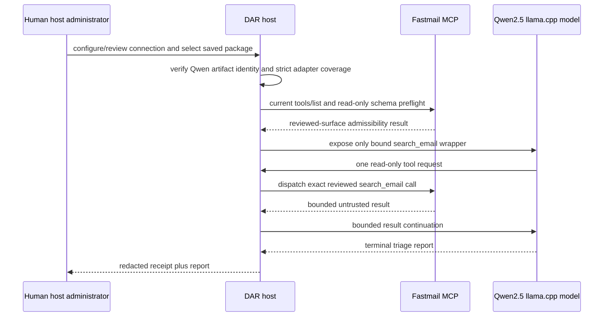

# Fastmail Inbox Triage Implementation Plan

## Status

Ready for gated implementation. T001/T002/T002a close the documented runtime
gaps before the local-model probe or Fastmail invocation, neither of which this
plan authorizes.

## Spec Trace

- Specification: `specs/fastmail-inbox-triage/spec.md`
- Discovery: `specs/fastmail-inbox-triage/discovery.md`
- Decisions: `specs/fastmail-inbox-triage/decision-log.md`
- Local adapter: `specs/llama-cpp-local-model/spec.md`
- Download receipt: `specs/local-model-availability-api/a5.2-copy-receipt.md`

## Objective

Create one saved, read-only DAR package that produces the approved bounded
inbox-triage report using the downloaded Qwen2.5 GGUF through direct in-process
llama.cpp and a single current reviewed Fastmail `search_email` capability.

The bound model is exactly:

| Field | Value |
| --- | --- |
| Repository | `Qwen/Qwen2.5-3B-Instruct-GGUF` |
| Revision | `7dabda4d13d513e3e842b20f0d435c732f172cbe` |
| File | `qwen2.5-3b-instruct-q4_k_m.gguf` |
| SHA-256 | `626b4a6678b86442240e33df819e00132d3ba7dddfe1cdc4fbb18e0a9615c62d` |
| Adapter | direct `LlamaCppLocalModelAdapter` with strict coverage |

This is the downloaded Qwen Instruct artifact recorded as GGUF/llama.cpp
eligible. The native-MLX Qwen artifact is out of scope.

## Current State

- DAR already has direct in-process llama.cpp sync/async adapters, strict model
  identity validation, and repository-owned local model-path resolution.
- The named GGUF model is available in DAR's default Hugging Face cache from a
  verified copy-only receipt; no model download or network access is required.
- The host already owns human Fastmail OAuth configuration, current
  reviewed-surface snapshots, capability binding, and redacted receipts.
- The generic read-only package template provides a starting shape only. It
  does not authorize copying a historical Fastmail schema or connection data.
- The former Apple Foundation Models B5.2 dependency is removed. Before package
  authoring, this feature instead needs a local llama.cpp tool-use preflight for
  the exact Qwen GGUF and its selected chat-format configuration.
- Current llama.cpp path resolution permits downloader wiring. T001/T002 must
  add a host-owned immutable local-model registration/preflight record that
  rehashes the GGUF, resolves only its verified local path, and proves downloader
  callables cannot run.

## Technical Approach

Use no new Fastmail transport, OAuth mechanism, model download flow, or runtime
provider selection. The host binds the exact reviewed `search_email` capability
and constructs a strict local llama.cpp adapter for the model above. The package
exposes that single read-only tool, has a one-dispatch budget, and renders the
terminal triage report from `spec.md`.

The package contains no Fastmail endpoint, OAuth scope, credential, raw tool
schema, connection identifier, model path, or model bytes. The host resolves
the approved cached artifact and revalidates model identity and reviewed surface
immediately before execution.

## Data Flow

Tool results are model-visible data, not instructions or authority. Failure of
model identity, local tool-call preflight, adapter coverage, surface checks, or
schema checks stops before remote dispatch or reports an inconclusive result.

## Milestones and Gates

### P0 — Prove exact Qwen llama.cpp tool use

- Dependency: direct llama.cpp adapter and recorded GGUF availability.
- Entry criteria: no Fastmail credential, mailbox data, or live network use.
- Deliverable: fake-backend and, only with explicit authorization, local-model
  evidence that the exact model/chat-format configuration produces one valid
  synthetic `search_email` call and then a validated terminal report after one
  synthetic result. Record fingerprint, llama.cpp version, tool envelope, and
  redacted digests only.
- The qualification uses the same registration, adapter, executor, zero-arg
  wrapper, projection, and terminal validator that P2 will bind; P2 may not
  alter the fingerprint. Mandatory-call semantics are DAR-level; capture the
  actual backend envelope because `chatml-function-calling` may translate it.
- Probe contract: the initial turn receives only a zero-argument synthetic tool
  and required choice; it must emit exactly one schema-valid `search_email`
  call. The continuation receives a bounded synthetic result with tools disabled
  and must emit zero calls plus the fixed terminal JSON envelope.
- Exit criterion: a model identity mismatch, unsupported tool format, ambiguous
  tool call, invalid arguments, second call, or missing/invalid terminal JSON
  blocks package authoring; it does not
  permit a fallback model or looser output contract.
- Verification: focused llama.cpp/local-model tests plus an explicitly approved
  local-only probe. A local probe never invokes Fastmail.

### P0.5 — Enforce phase-specific tool exposure

- Deliverable: sync/async runtime support that exposes the one required tool on
  the initial turn and no tool definitions or choice after its result.
- Test-first exit criterion: executor parity tests prove the second request has
  `tools=()` and no tool choice. Existing executor behavior is not assumed to
  provide this.

### P1 — Prove package policy with fakes

- Dependency: P0 and P0.5 successful results.
- Test-first rule: write focused failing fake tests before package fixture or
  test-helper changes, then record RED/GREEN evidence in `validation.md`.
- Deliverable: de-identified fixture and fake tests prove one exposed read-only
  capability, one dispatch maximum, five-message truncation, strict Qwen model
  binding, hostile-content non-escalation, redaction, and zero mutation.

### P2 — Author and finalize the saved package

- Dependency: P1 and a human-approved `material_set_id` containing current
  reviewed capability context.
- Deliverable: a validated four-file DAR package generated through existing
  host-owned authoring and finalization commands.
- Exit criterion: a human selects/registers it with the exact Qwen adapter and
  reviewed Fastmail binding.

### P3 — Conduct opt-in acceptance

- Dependency: P2, green automated validation, and new explicit human
  authorization naming this package, cached Qwen artifact, Fastmail connection,
  and one read-only dispatch.
- Deliverable: one manually reviewed terminal report and redacted receipt.
- Exit criterion: a pre-dispatch receipt proves current reviewed capability
  identity/schema and host-only semantic mapping; evidence retains only package
  and transcript digests, status, dispatch count, and bounded diagnostics; not
  email/OAuth/schema content.

## Verification Strategy

| Requirement | Test or check | Command |
| --- | --- | --- |
| FR-001 | Fake reviewed-surface/current-client/schema tests | `poetry run pytest tests/test_dar_authoring_mcp_surfaces.py -q` |
| FR-002 | Fake strict llama.cpp identity/coverage tests | `poetry run pytest tests/test_local_models.py tests/test_dar_authoring_host.py -q` |
| FR-003, FR-006 | Fake capability binding and package-budget tests | `poetry run pytest tests/test_dar_authoring_mcp_tools.py tests/test_dar_authoring_authorized_tools.py -q` |
| FR-004, FR-005 | Fake tool-result, redaction, and injection tests | focused host/package tests selected during P1 |
| Local model prerequisite | P0 fake tests and explicitly authorized local-only probe | no default live command |
| Live Fastmail acceptance | explicit human authorization only | no default command; redacted receipt only |
| Regression and hygiene | full tests, lint, hooks, whitespace | `poetry run pytest -q`; `poetry run ruff check src tests`; `pre-commit run --all-files`; `git diff --check` |

## Risks and Mitigations

| Risk | Trigger | Mitigation and fallback |
| --- | --- | --- |
| Qwen GGUF cannot produce a valid tool call/final continuation. | P0 lacks a qualifying result. | Block P1-P3; do not switch model or weaken contract without a new spec decision. |
| Cached artifact identity drifts or is absent. | SHA/revision/path validation fails. | Fail before model or Fastmail access; restore the approved artifact through separate authorized local-model work. |
| Fastmail schema cannot express bounded unread query. | Current reviewed preflight finds incompatibility. | Do not author package; revise spec from redacted capability facts. |
| Prompt injection requests authority escalation. | Email/tool content asks for an action. | Fixed system prompt, one bound read tool, strict budget, adversarial fake tests. |
| Evidence includes sensitive content. | Trace stores raw output/schema. | Fakes in tests; redaction assertions; acceptance stores digests/status/counts only. |

## Plan Approval

- Status: approved 2026-09-05 for gated implementation
- Notes: this replaces the former Apple B5.2 dependency with the exact Qwen
  llama.cpp P0 gate and does not waive local-probe or Fastmail authorization.
